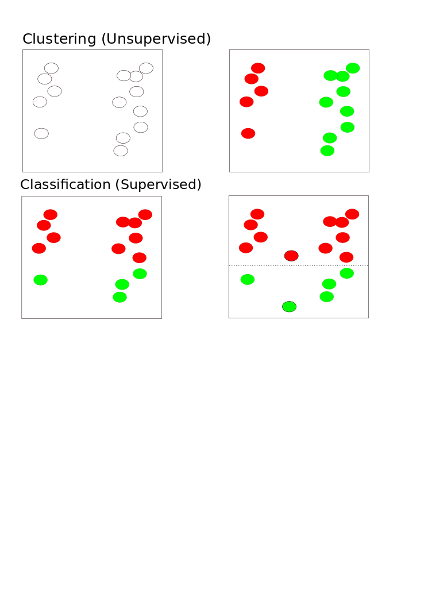
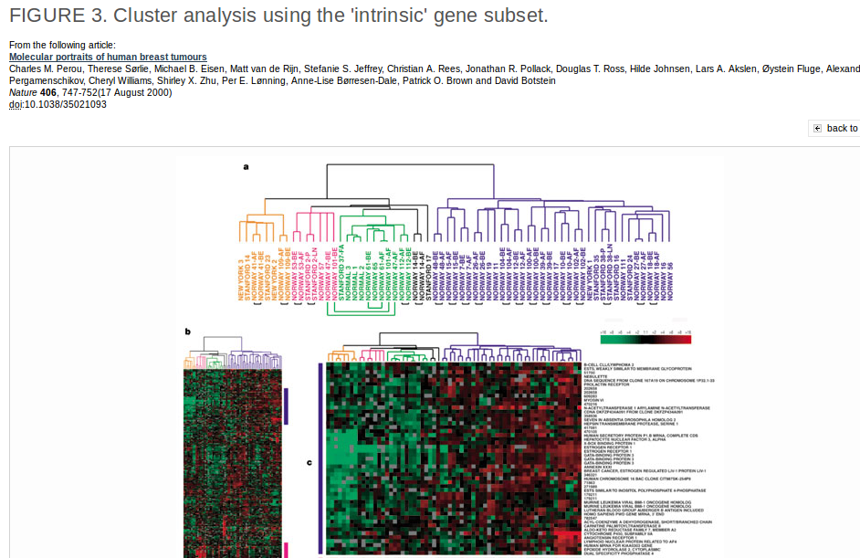
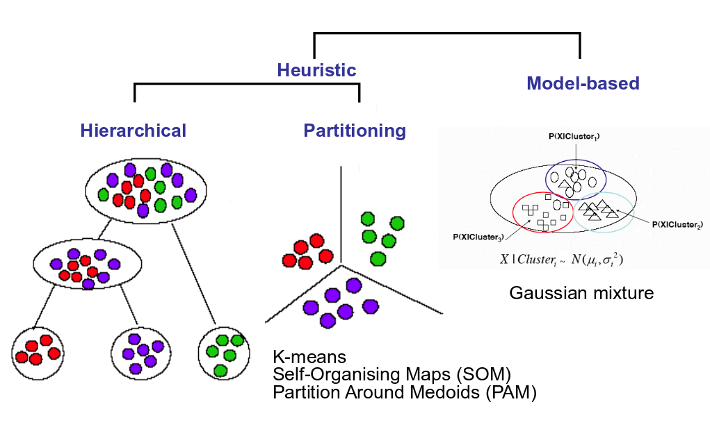
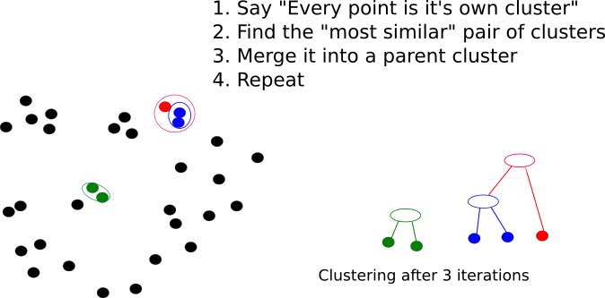
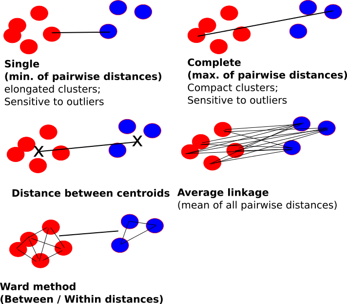
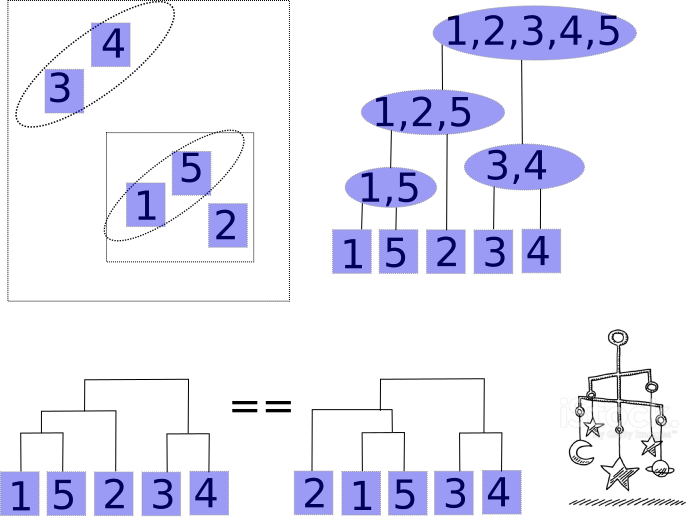

# Clustering


## Clustering.. or Classification?

- **Unsupervised:** classes unknown, want to discover them from the data (cluster analysis)
- **Supervised:** classes are predefined, want to use a (training or learning) set of labelled objects to form a classifier for classification of future observations



## Why do clustering for genomic data?

- Clustering leads to readily interpretable figures and can be helpful for identifying patterns in time or space.
- We can cluster samples (columns)
    + e.g. identification of new / unknown tumor classes using gene expression profiles
- We can cluster genes (rows)
    + e.g. using large numbers of yeast experiments to identify groups of co-regulated genes
    + we can cluster genes to reduce redundancy (i.e. variable selection) in predictive models
    
## Subtype Discovery    
- There are plenty of examples of using clustering to discover subtypes in the literature



## Clustering as QA

- Also used as a quality assessment tool
    + to check for outlier samples
    + (microarray data)
    
```{r echo=FALSE,message=FALSE}
library(beadarrayExampleData)
data("exampleSummaryData")
data <- channel(exampleSummaryData, "G")
d <- dist(t(exprs(data)))
plot(hclust(d))
```

## Clustering as QA    
- Can check within / between experiment variability and potential confounding factors (batch effect etc)
    
```{r,results='hide',message=FALSE,warning=FALSE,echo=FALSE}
library(WGCNA)
```

```{r echo=FALSE,message=FALSE}
data.noout <- data[,-c(7,8)]
d <- dist(t(exprs(data.noout)))
pd <- pData(data.noout)
cols <- ifelse(pd[,2] =="UHRR", "red","blue")
cols2 <- ifelse(strtrim(sampleNames(data.noout),5) == "46137","yellow","green")

colM <- cbind(cols,cols2)
colnames(colM) <- c("Group","Batch")
plotDendroAndColors(hclust(d), as.matrix(colM))

```

## Clustering Overview

- Steps in a Cluster Analysis
    1. Preprocess the data
    2. Choose a *dissimilarity* measure
    3. Choose a cluster algorithm
    4. Select the number of clusters
    5. Validate the procedure
    
## Preprocessing
    
When clustering genes, it is common to pre-process;

- normalise
- filter; remove genes with low variability across samples and many missing values
- (impute missing values)
- standardise; e.g. zero-mean and, unit variance:
    + $y_g^* = (y_g - \mu_g)/\sigma_g$
    
## How to compute similarity
Common *Similarity* / *Dissimilarity* measures include

- Correlation coefficient; *scale invariant*
    + Pearson's correlation;
    + Spearman correlation of ranks
    
- Distance: scale dependant
    + Euclidean distance; $d(x,y) = \sqrt{\sum_i (x_i - y_i)^2}$
    + City block (Manhattan) distance; $d(x,y) = \sum | x_i - y_i |$
    + and others.....

- ***Warning***: Don't get too hung-up on the choice of measure
    + Clustering is primarily an exploratory tool
    + If your data has signal, it should show regardless of which measure you choose
    + Don't just pick the one which "looks the best"
    
## How to compute similarity, in R

The `dist` function can be used to calculate a variety of similarity measures

- As usual, we can do `?dist`. 
- The input is a matrix of numerical values
- Let's test with some sample data

```{r echo=FALSE}
set.seed(10032016)
```


```{r}
myMatrix <- matrix(rnorm(1000),ncol=10)
colnames(myMatrix) <- LETTERS[1:10]
head(myMatrix)
```

## How to compute similarity, in R

- The default is to compute distances from the *rows* of the matrix
    + i.e. which would normally be the genes we are measuring
- Also note that the matrix has some values that appear to be missing
    + why do you think that might be?

```{r eval=FALSE}
d <- dist(myMatrix)
d
```

## How to compute similarity, in R

- The more common use of clustering is to cluster the columns (*samples*)
- To do this, we have to *transpose* the matrix; using the function `t`

```{r}
d <- dist(t(myMatrix))
d
```


## How to compute similarity, in R

- Changing the type of distance measure can be done by changing the `method` argument

```{r}
d.man <- dist(t(myMatrix),method="manhattan")
d.man
```

## How to calculate correlation in R

- This time we use the `cor` function (`?cor`)
- What do you notice about the output, compared to that of `dist`?

```{r}
cor(myMatrix)
```

## How to calculate correlation in R

- Clustering algorithms will expect input in distance matrix form
- We can convert using `as.dist`

```{r}
corMat <- as.dist(cor(myMatrix))
corMat
```

## How to calculate correlation in R

- Two samples with a *higher correlation* values means *more similar*
- ...so the *distance* between is *less*


```{r}
corMat <- as.dist(1-abs(cor(myMatrix)))
corMat
```


## Correlation versus Distance

- A simple toy example of three genes
    + which genes seem to be closest?

```{r, echo=FALSE}
par(mfrow=c(1,1))
arrays <- 1:10
gene2 <- c(-1, -0.5, 0.3, -0.4,0.7,0.9, 1.1,0.8,1.5,1.3)
gene1 <- gene2+2
gene3 <- gene1 + runif(10,min = -0.4,0.4)
plot(arrays,gene1,type="b",pch=16,col="blue",ylim=c(-2,4))
lines(arrays,gene2,type="b",col="red",pch=16)
lines(arrays,gene3,type="b",col="green",pch=16)
legend("topleft",legend=c("Gene1","Gene2","Gene3"),col=c("red","blue","green"),lty=1,lwd=2)
```


## Correlation versus Distance

- Using Euclidean distance

```{r echo=FALSE}
geneMatrix <- rbind(gene1,gene2,gene3)
dist(geneMatrix)
```

- Correlation matrix

```{r echo=FALSE}
cor(t(geneMatrix))
par(mfrow=c(1,2))
plot(hclust(dist(geneMatrix)),main="Distance = Euclidean")
plot(hclust(as.dist(1-cor(t(geneMatrix)))),main="Distance = Correlation")

```


    
## Choice of algorithm    
    
Clustering Algorithms



## Hierachical methods

- start with *n* samples (or $p$ gene) clusters
- At each step, *merge* the two closest clusters using a measure of *between-cluster* dissimilarity which reflects the shape of the clusters
- The distance between the clusters is defined by the method used (e.g. in *complete linkage*, the distance is defined as the distance between the furthest pair of points in the two clusters)

## Hierachical methods



## Between-cluster dissimilarity measures



## Hierachical Clustering

- Dendrograms are good visual guides, but *arbitrary*
- Nodes can be reordered
    + Closer on dendrogram $\ne$ more similar




## Performing hierachical clustering, in R

- The function to use here is `hclust` (`?hclust`)
- It takes a distance matrix that you computed previously

```{r}
clust <- hclust(d)
clust
```

## Performing hierachical clustering, in R

- The standard plotting function has been extended to visualise the result of the clustering

```{r}
plot(clust)
```

## Performing hierachical clustering, in R

- We can change the name of the method


```{r}
clust.ward <- hclust(d,method = "ward.D")
par(mfrow=c(1,2))
plot(clust)
plot(clust.ward)
```

## Accessing the clustering object

- Two useful functions are `cutree` and `rect.hclust`
- Can be used to "cut" the dendrogram at a particular height

```{r}
par(mfrow=c(1,1))
plot(clust)
cutree(clust, h=16)
rect.hclust(clust, h=16)
```

## Accessing the clustering object

- Alternatively, we can see the number of clusters; *k*
- Try experimenting with different values of k....

```{r}
plot(clust)
cutree(clust, k=2)
rect.hclust(clust, k=2)
```


## What is the optimal number of clusters?

- A measure called the ***silhouette width*** can be computed.
- The silhouette measures how well-matched an object is to others in it's own cluster, versus how well-matched it would be if it were moved to the next closest cluster
- Value around 0 -> a gene lies between two clusters
- Value of -1 -> gene is similar to element in neighbour cluster and probably in the wrong cluster
- Value of around 1 -> good clustering
- Output from `silhouette` function for the gene expression example earlier

```{r echo=FALSE}
library(cluster)
d <- dist(t(exprs(data.noout)))
par(mfrow=c(1,2))
pr <- pam(d, 2)
si4 <- silhouette(pr)
par(mfrow=c(1,2))
plot(hclust(d))
rect.hclust(hclust(d),k=2)
plot(si4, col = c("red", "blue"),main="")# with cluster-wise coloring

```

    
    
## Summary of clustering

- Useful as ***exploratory / visualisation*** tools
- Choice of metric, methods and parameters usually guided by prior knowledge about the question
    + The result is guided by what you are looking for
- Validate using different algorithms
- Use prior Biological knowledge, or your sample meta data to see if the clusters make sense
- Be aware
    + Clustering will always produce something. It cannot NOT work
    

```{r message=FALSE,eval=FALSE} 
library("pasilla")
library("Biobase")
data("pasillaGenes")
countData <- counts(pasillaGenes)
colData <- pData(pasillaGenes)[,c("condition","type")]
```

```{r,eval=FALSE}
library(DESeq2)
dds <- DESeqDataSetFromMatrix(countData = countData,
colData = colData,
design = ~ condition)
```

```{r,eval=FALSE}
featureData <- data.frame(gene=rownames(pasillaGenes))
(mcols(dds) <- DataFrame(mcols(dds), featureData))
```

```{r,eval=FALSE}
dds <- estimateSizeFactors(dds)
```


```{r,eval=FALSE}
library("pheatmap")
select <- order(rowMeans(counts(dds,normalized=TRUE)),decreasing=TRUE)[1:20]
```

```{r,eval=FALSE}
nt <- normTransform(dds) # defaults to log2(x+1)
log2.norm.counts <- assay(nt)[select,]
df <- as.data.frame(colData(dds)[,c("condition","type")])
```

```{r,eval=FALSE}
pheatmap(log2.norm.counts, cluster_rows=FALSE, show_rownames=FALSE,
cluster_cols=FALSE, annotation_col=df)
```

```{r,eval=FALSE}
rld <- rlog(dds,blind = TRUE)
vsd <- varianceStabilizingTransformation(dds)
head(assay(rld), 3)
```

```{r,eval=FALSE}
sampleDists <- dist(t(assay(rld)))
sampleDists
```


```{r,eval=FALSE}
library("RColorBrewer")
sampleDistMatrix <- as.matrix(sampleDists)
rownames(sampleDistMatrix) <- paste(rld$condition, rld$type, sep="-")
colnames(sampleDistMatrix) <- NULL
colors <- colorRampPalette( rev(brewer.pal(9, "Blues")) )(255)
pheatmap(sampleDistMatrix,
clustering_distance_rows=sampleDists,
clustering_distance_cols=sampleDists,
col=colors)
```

```{r,eval=FALSE}
plotPCA(rld, intgroup=c("condition", "type"))
```

