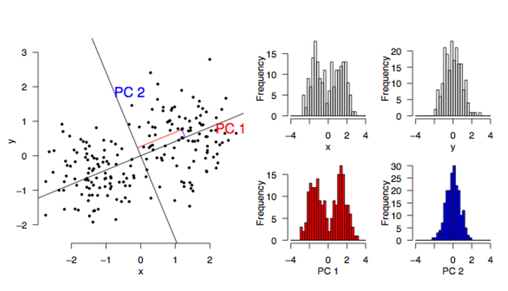
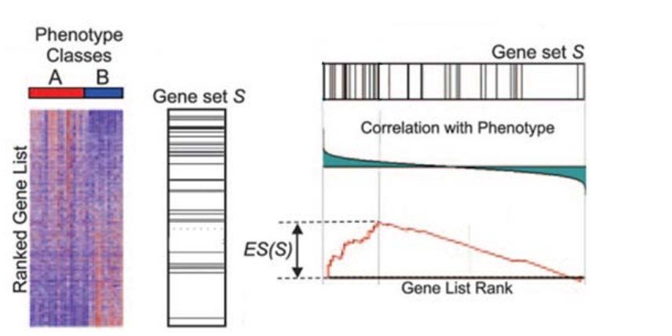

# Clustering (and PCA)


## Clustering.. or Classification?

- **Unsupervised:** classes unknown, want to discover them from the data (cluster analysis)
- **Supervised:** classes are predefined, want to use a (training or learning) set of labelled objects to form a classifier for classification of future observations


## Why do clustering for genomic data?

- Clustering leads to readily interpretable figures and can be helpful for identifying patterns in time or space.
- We can cluster samples (columns)
    + e.g. identification of new / unknown tumor classes using gene expression profiles
- We can cluster genes (rows)
    + e.g. using large numbers of yeast experiments to identify groups of co-regulated genes
    + we can cluster genes to reduce redundancy (i.e. variable selection) in predictive models
    
## Subtype Discovery    
- There are plenty of examples of using clustering to discover subtypes in the literature


## Clustering as QA

- Also used as a quality assessment tool
    + to check for outlier samples
    + (microarray data)
    
```{r echo=FALSE,message=FALSE}
library(beadarrayExampleData)
data("exampleSummaryData")
data <- channel(exampleSummaryData, "G")
d <- dist(t(exprs(data)))
plot(hclust(d))
```

## Clustering as QA    
- Can check within / between experiment variability and potential confounding factors (batch effect etc)
    
```{r,results='hide',message=FALSE,warning=FALSE,echo=FALSE}
library(WGCNA)
```

```{r echo=FALSE,message=FALSE}
data.noout <- data[,-c(7,8)]
d <- dist(t(exprs(data.noout)))
pd <- pData(data.noout)
cols <- ifelse(pd[,2] =="UHRR", "red","blue")
cols2 <- ifelse(strtrim(sampleNames(data.noout),5) == "46137","yellow","green")

colM <- cbind(cols,cols2)
colnames(colM) <- c("Group","Batch")
plotDendroAndColors(hclust(d), as.matrix(colM))

```

## Clustering Overview

- Steps in a Cluster Analysis
    1. Preprocess the data
    2. Choose a *dissimilarity* measure
    3. Choose a cluster algorithm
    4. Select the number of clusters
    5. Validate the procedure
    
## Preprocessing
    
When clustering genes, it is common to pre-process;

- normalise
- filter; remove genes with low variability across samples and many missing values
- (impute missing values)
- standardise; e.g. zero-mean and, unit variance:
    + $y_g^* = (y_g - \mu_g)/\sigma_g$
    
## How to compute similarity
Common *Similarity* / *Dissimilarity* measures include

- Correlation coefficient; *scale invariant*
    + Pearson's correlation;
    + Spearman correlation of ranks
    
- Distance: scale dependant
    + Euclidean distance; $d(x,y) = \sqrt{\sum_i (x_i - y_i)^2}$
    + City block (Manhattan) distance; $d(x,y) = \sum | x_i - y_i |$
    + and others.....

- ***Warning***: Don't get too hung-up on the choice of measure
    + Clustering is primarily an exploratory tool
    + If your data has signal, it should show regardless of which measure you choose
    + Don't just pick the one which "looks the best"
    
## How to compute similarity, in R

The `dist` function can be used to calculate a variety of similarity measures

- As usual, we can do `?dist`. 
- The input is a matrix of numerical values
- Let's test with some sample data

```{r echo=FALSE}
set.seed(10032016)
```


```{r}
myMatrix <- matrix(rnorm(1000),ncol=10)
colnames(myMatrix) <- LETTERS[1:10]
head(myMatrix)
```

## How to compute similarity, in R

- The default is to compute distances from the *rows* of the matrix
    + i.e. which would normally be the genes we are measuring
- Also note that the matrix has some values that appear to be missing
    + why do you think that might be?

```{r eval=FALSE}
d <- dist(myMatrix)
d
```

## How to compute similarity, in R

- The more common use of clustering is to cluster the columns (*samples*)
- To do this, we have to *transpose* the matrix; using the function `t`

```{r}
d <- dist(t(myMatrix))
d
```


## How to compute similarity, in R

- Changing the type of distance measure can be done by changing the `method` argument

```{r}
d.man <- dist(t(myMatrix),method="manhattan")
d.man
```

## How to calculate correlation in R

- This time we use the `cor` function (`?cor`)
- What do you notice about the output, compared to that of `dist`?

```{r}
cor(myMatrix)
```

## How to calculate correlation in R

- Clustering algorithms will expect input in distance matrix form
- We can convert using `as.dist`

```{r}
corMat <- as.dist(cor(myMatrix))
corMat
```

## How to calculate correlation in R

- Two samples with a *higher correlation* values means *more similar*
- ...so the *distance* between is *less*


```{r}
corMat <- as.dist(1-abs(cor(myMatrix)))
corMat
```


## Correlation versus Distance

- A simple toy example of three genes
    + which genes seem to be closest?

```{r, echo=FALSE}
par(mfrow=c(1,1))
arrays <- 1:10
gene2 <- c(-1, -0.5, 0.3, -0.4,0.7,0.9, 1.1,0.8,1.5,1.3)
gene1 <- gene2+2
gene3 <- gene1 + runif(10,min = -0.4,0.4)
plot(arrays,gene1,type="b",pch=16,col="blue",ylim=c(-2,4))
lines(arrays,gene2,type="b",col="red",pch=16)
lines(arrays,gene3,type="b",col="green",pch=16)
legend("topleft",legend=c("Gene1","Gene2","Gene3"),col=c("red","blue","green"),lty=1,lwd=2)
```


## Correlation versus Distance

- Using Euclidean distance

```{r echo=FALSE}
geneMatrix <- rbind(gene1,gene2,gene3)
dist(geneMatrix)
```

- Correlation matrix

```{r echo=FALSE}
cor(t(geneMatrix))
par(mfrow=c(1,2))
plot(hclust(dist(geneMatrix)),main="Distance = Euclidean")
plot(hclust(as.dist(1-cor(t(geneMatrix)))),main="Distance = Correlation")

```


    
## Choice of algorithm    
    
Clustering Algorithms


## Hierachical methods

- start with *n* samples (or $p$ gene) clusters
- At each step, *merge* the two closest clusters using a measure of *between-cluster* dissimilarity which reflects the shape of the clusters
- The distance between the clusters is defined by the method used (e.g. in *complete linkage*, the distance is defined as the distance between the furthest pair of points in the two clusters)

## Hierachical methods


## Between-cluster dissimilarity measures


## Hierachical Clustering

- Dendrograms are good visual guides, but *arbitrary*
- Nodes can be reordered
    + Closer on dendrogram $\ne$ more similar


## Performing hierachical clustering, in R

- The function to use here is `hclust` (`?hclust`)
- It takes a distance matrix that you computed previously

```{r}
clust <- hclust(d)
clust
```

## Performing hierachical clustering, in R

- The standard plotting function has been extended to visualise the result of the clustering

```{r}
plot(clust)
```

## Performing hierachical clustering, in R

- We can change the name of the method


```{r}
clust.ward <- hclust(d,method = "ward.D")
par(mfrow=c(1,2))
plot(clust)
plot(clust.ward)
```

## Accessing the clustering object

- Two useful functions are `cutree` and `rect.hclust`
- Can be used to "cut" the dendrogram at a particular height

```{r}
par(mfrow=c(1,1))
plot(clust)
cutree(clust, h=16)
rect.hclust(clust, h=16)
```

## Accessing the clustering object

- Alternatively, we can see the number of clusters; *k*
- Try experimenting with different values of k....

```{r}
plot(clust)
cutree(clust, k=2)
rect.hclust(clust, k=2)
```


## What is the optimal number of clusters?

- A measure called the ***silhouette width*** can be computed.
- The silhouette measures how well-matched an object is to others in it's own cluster, versus how well-matched it would be if it were moved to the next closest cluster
- Value around 0 -> a gene lies between two clusters
- Value of -1 -> gene is similar to element in neighbour cluster and probably in the wrong cluster
- Value of around 1 -> good clustering
- Output from `silhouette` function for the gene expression example earlier

```{r echo=FALSE}
library(cluster)
d <- dist(t(exprs(data.noout)))
par(mfrow=c(1,2))
pr <- pam(d, 2)
si4 <- silhouette(pr)
par(mfrow=c(1,2))
plot(hclust(d))
rect.hclust(hclust(d),k=2)
plot(si4, col = c("red", "blue"),main="")# with cluster-wise coloring

```

    
    
## Summary of clustering

- Useful as ***exploratory / visualisation*** tools
- Choice of metric, methods and parameters usually guided by prior knowledge about the question
    + The result is guided by what you are looking for
- Validate using different algorithms
- Use prior Biological knowledge, or your sample meta data to see if the clusters make sense
- Be aware
    + Clustering will always produce something. It cannot NOT work
    
## Application of clustering to RNA-seq

- Clustering is a generic technique that can be applied to many forms of data
    + We will use it on RNA-seq, but it can be used on ChIP-seq (see tomorrow), or DNA-seq data
- Quality assessment of samples
      + checking for batch effects and outliers
      + check effectiveness of normalisation / transformation

# Principal Components Analysis (PCA)

## Why Use PCA

- In genomic data, we have a large number of variables which are often highly correlated

- PCA is one of many *dimension-reduction* techniques that can remove redundancy and give a smaller more mangeable set of variables. In summary it can help us to:-

- Reduce *dimensionality* of the data
- Decrease the *redundancy* of the data
- Filter the *noise* in the data
- *Compress* the data


## PCA Example: Whisky

The data: 86 malt whiskies scored for 12 different taste categories

(https://www.mathstat.strath.ac.uk/outreach/nessie/nessie_whisky.html)

- Q. Can we find which whiskies have a similar taste profile?
- Q. What are the factors that determine the taste profile?

```{r echo=FALSE}
whisky <- read.csv("whiskies.txt")
scores <- whisky[,c(3:14)]
rownames(scores) <- whisky$Distillery
head(scores,n=3)
```

## PCA Example

```{r echo=FALSE,fig.align="center",fig.width=12}
pca <- prcomp(scores)
df <- data.frame(whisky,pca$x)
library(ggplot2)
ggplot(df, aes(x=PC1,y=PC2,label=Distillery)) + geom_point() + geom_text(alpha=0.3)

```

## PCA Example

```{r echo=FALSE,fig.align="center",fig.width=14}
pca <- prcomp(scores)
df <- data.frame(whisky,pca$x)
library(ggplot2)
ggplot(df, aes(x=PC1,y=PC2,label=Distillery,cex=Smoky,col=as.factor(Floral))) + geom_point() + geom_text(cex=5,alpha=0.3)

```


## More-relevant example

- MAQC microarrays with mixtures of Brain and Reference RNA (UHRR) at different concentrations
- Run in different labs
    + what do you notice?

```{r echo=FALSE,warning=FALSE}
suppressPackageStartupMessages(library(MAQCsubsetILM))


data(refA);data(refB);data(refC);data(refD)
gse = combine(refA, refB, refC, refD)
sites = pData(gse)[,2]
shortlabels = substr(sampleNames(gse), 7,8)
rnasource = pData(gse)[,3]
levels(rnasource) = c("UHRR", "Brain", "UHRR75", "UHRR25")

d <- dist(t(exprs(gse)))
pc <- princomp(d)


Lab <- paste("Lab",sites,sep="")
df <- data.frame(Lab,rnasource,PC1=pc$loadings[,1],PC2=pc$loadings[,2])
ggplot(df, aes(x = PC1,y=PC2, col=rnasource,pch=Lab)) + geom_point(cex=5)

```

## More-relevant example

So, PCA can be used as a quality assessment tool and can inform us of any factors we need to account for in the analysis

- In this case we could correct for the batch effect, or add a batch factor to the linear model for analysis

```{r echo=FALSE}
suppressPackageStartupMessages(library(limma))
gse.batchcorrect <- removeBatchEffect(log2(exprs(gse)), batch=sites)
d2 <- dist(t(gse.batchcorrect))
pc2 <- princomp(d2)

df <- data.frame(Lab,rnasource,PC1=pc2$loadings[,1],PC2=pc2$loadings[,2])
ggplot(df, aes(x = PC1,y=PC2, col=rnasource,pch=Lab)) + geom_point(cex=5)

```

## What is going-on here?

A two-dimensional case

- Find direction of most variation (PC1)
- Direction that explains next amount of variation is orthogonal (at 90 degrees) (PC2)
- Each point on original x and y is a linear combination of PC1 and PC2
- Higher dimensional data can have many more components PC3, PC4....
    + although they will become increasingly less-influential



## Worked example

Getting the data...

```{r}
whisky <- read.csv("https://www.mathstat.strath.ac.uk/outreach/nessie/datasets/whiskies.txt")
scores <- whisky[,c(3:14)]
rownames(scores) <- whisky$Distillery
head(scores,n=3)
```

## Running the PCA

The `prcomp` function does the hard-work for us

- It is computing *eigenvectors* and *eigenvalues* from our input matrix
    + or rather the covariance matrix
- We have 12 components (as we had 12 variables)
- The components are ordered according to the amount of variance they *explain*

```{r}
pca <- prcomp(scores)
summary(pca)
```

## Dissecting the PCA results

- Each column in a principal component
    + in decreasing order of importance
- The values are the measure of importance for each component
    + e.g. Smoky seems to be important for PC1
    + Smoky and Floral are opposite ends of the spectrum for PC1
    
```{r}
pca$rotation[,1:5]
```

## How many components?

We look at the variance explained by each component and judge where it "drops-off"

- Sometimes called a "scree-plot"
```{r}
plot(pca)
```

## How many components?


## Dissecting the PCA results

The new co-ordinate system is given by `pca$x`

- One row for each of our whiskies, one column for each component
- The original coordinates are a linear combination of the new ones
    + an exercise for the reader?

```{r}
pca$x[1:3,1:5]
```

## Dissecting the PCA results

`ggplot2` is especially convenient for visualising the results

- An overlay of the known variables will highlight the patterns
- As with clustering, PCA is to be used as an exploratory tool

```{r}
df <- data.frame(whisky,pca$x)
ggplot(df, aes(x=PC1,y=PC2,label=Distillery,cex=Smoky,col=as.factor(Floral))) + geom_point() + geom_text(cex=5,alpha=0.3)
```

# Enrichment Analysis


## Theory Part I: Over-representation analysis

- "Threshold-based": require defintion of a statistical threshold to define list of genes to test (e.g. FDR < 0.01)
- Hypergeometric test, Fisher's Exact test is used.

The question we are asking here is;

> ***"Are the number of DE genes associated with Theme X significantly greater than what we might expect by chance alone?"***

Where Theme X could be genes belonging to a particular GO (Gene Onotology) term.


## Toy example 

Let's imagine that we have a bag full of balls. Each balls represents a gene in the *gene universe*. 
- Paint the balls representing our selected list grey, and paint the rest red.


In this small example, we can define;

- Total number of balls: 40
- Total number of interesting (grey) balls: 10

## Toy example

Select a number (say, 12) of the balls at random without seeing into the bag and look at what we get


## Toy example

We have picked, at random, 8 grey balls. 

- We can repeat the process and look at how many grey we get. 
- We can (of course!) do this in R. 
    + In base R there is a family of functions that can generate random draws from various distributions; `rnorm`, `rbinom`, `rhyper` etc....

```{r fig.height=3}
#see ?rhyper for argument definition
trials <- rhyper(10000,40,10,12)
hist(trials)

```

## Toy example

```{r}
table(trials)
table(trials)/10000
cumsum(table(trials)/10000)
1-cumsum(table(trials)/10000)
```


## Toy example

Back to our example, the distribution of balls can be expressed as a contingency table, on which we can use a Fisher's exact test

Total grey balls: 10
Total in subset: 12

```{r results='asis',echo=FALSE}
library(knitr)
df <- data.frame(Selection_in = c(8,4), Selection_out = c(2,26))
rownames(df) <- c("Grey_in", "Grey_out")
kable(df)
```

## Toy example

```{r results='asis',echo=FALSE}
df <- data.frame(Selection_in = c("a","c","a+c"), Selection_out = c("b","d","b+d"), RowTotal = c("a +b","c+d","a+b+c+d (=n)"))
rownames(df) <- c("Grey_in", "Grey_out","Column Total")
kable(df)
```

The formula for Fishers exact test is;

$$ p = \frac{\binom{a + b}{a}\binom{c +d}{c}}{\binom{n}{a +c}} = \frac{(a+b)!(c+d)!(a+c)!(b+d)!}{a!b!c!d!n!} $$

or less formally;

*P = (ways of choosing grey balls) X (ways of non-grey balls amongst subset) / ways of choosing subset*

## Implementation in R

- We don't need to remember this formula as R will calculate the probability for us
- We will use `goseq` in the practical
    + The package will also deal with the mapping of genes to GO cateogories
    + It has corrections for gene-length too
    
- Other options;
  + GOstats (not specifically for NGS?)
  + topGO (see [here](http://www-huber.embl.de/users/klaus/Teaching/DESeq2Predoc2014.html#gene-ontology-enrichment-analysis) for a nice worked-example)
  + various others in [BioC](http://bioconductor.org/packages/release/BiocViews.html#___GeneSetEnrichment)
  + online tools; DAVID, Genetrail
  
## Theory Part II: Threshold-free

For these tests, we don't have to specify a statistical threshold and use the test statistics from *all* genes as the input to the test. The popular *Gene Set Enrichment Analysis (GSEA)* uses this approach. These tests can be used to detect differential expression for a group of genes, even when the effects are too small or there is too little data to detect the genes individually.



*Subramanian et al, PNAS 2005*

## Theory Part II: Threshold-free


- The Broad institute provides [a version of GSEA](http://software.broadinstitute.org/gsea/index.jsp) that can be run via a java application. 
- However, it requires you to convert your data into a particular format. A more convenient option is [***GeneTrail***](http://genetrail.bioinf.uni-sb.de/enrichment_analysis.php?js=1&cc=1) which has the option to do a GSEA-style analysis.

The required input text contains a set of gene identifiers that are ordered according to some test statistic. To produce such a file, we first have to order the statistics from our test (e.g. with the `order` function)

```{r eval=FALSE}
load("Day3/edgeRAnalysis_ALLGENES.RData")
y <- y[order(y$LR,decreasing = TRUE),]
write.table(y, file="genetrail-gsea.txt",sep="\t",row.names = FALSE,quote=FALSE)
```


## A Threshold-free test in Bioconductor

- Simple version of this test is implemented in the `geneSetTest` function in `limma`,
- Computes a p-value to test the hypothesis that the selected genes have more extreme
test-statistics than one might expect by chance. 

e.g. pick 50 genes at random. 

```{r fig.height=3}
library(limma)
load("Day3/edgeRAnalysis_ALLGENES.RData")
stats <- y$logFC
myGenes <- sample(1:nrow(y),50)
geneSetTest(index = myGenes, statistics = stats)
barcodeplot(stats, index=myGenes)
```


## A Threshold-free test in Bioconductor

On the other hand, we could deliberately pick genes with a significant p-value and notice how the results are altered.

```{r fig.height=3}

myGenes <- which(y$FDR < 0.01)[1:50]

geneSetTest (index = myGenes , statistics = stats)

geneSetTest (index = myGenes , statistics = stats ,
  alternative = "down" )

geneSetTest (index = myGenes , statistics = stats ,
  alternative = "up" )

barcodeplot (statistics = stats , index = myGenes )

```


