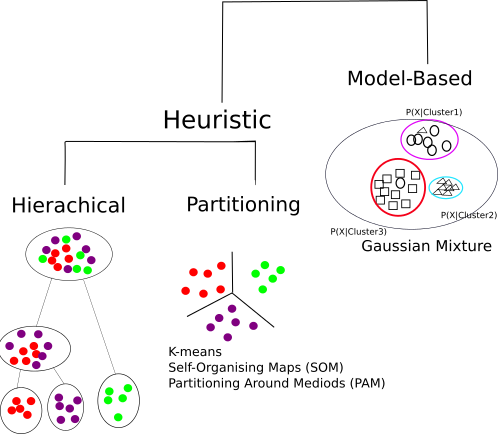

Acknowledgements: Oscar Rueda

# Clustering

## Clustering.. or Classification?

- **Unsupervised:** classes unknown, want to discover them from the data (cluster analysis)
- **Supervised:** classes are predefined, want to use a (training or learning) set of labelled objects to form a classifier for classification of future observations


- Clustering leads to readily interpretable figures and can be helpful for identifying patterns in time or space.
- We can cluster samples (columns)
    + e.g. identification of new / unknown tumor classes using gene expression profiles
- We can cluster genes (rows)
    + e.g. using large numbers of yeast experiments to identify groups of co-regulated genes
    + we can cluster genes to reduce redundancy (i.e. variable selection) in predictive models
    
- There are plenty of examples of using clustering to discover subtypes in the literature


- Also used as a quality assessment tool
    + to check for outlier samples

```{r echo=FALSE,message=FALSE}
library(beadarrayExampleData)
data("exampleSummaryData")
data <- channel(exampleSummaryData, "G")
d <- dist(t(exprs(data)))
plot(hclust(d))
```
    
- Can check within / between experiment variability and potential confounding factors (batch effect etc)
    
```{r,results='hide',message=FALSE,warning=FALSE,echo=FALSE}
library(WGCNA)
```

    
    
```{r echo=FALSE,message=FALSE}
data.noout <- data[,-c(7,8)]
d <- dist(t(exprs(data.noout)))
pd <- pData(data.noout)
cols <- ifelse(pd[,2] =="UHRR", "red","blue")
cols2 <- ifelse(strtrim(sampleNames(data.noout),5) == "46137","yellow","green")

colM <- cbind(cols,cols2)
colnames(colM) <- c("Group","Batch")
plotDendroAndColors(hclust(d), as.matrix(colM))

```

## Clustering Overview

- Steps in a Cluster Analysis
    + Preprocess the data
    + Choose a *dissimilarity* measure
    + Choose a cluster algorithm
    + Select the number of clusters
    + Validate the procedure
    
## Preprocessing
    
When clustering genes, it is common to pre-process;
    + normalise
    + filter; remove genes with low variability across samples and many missing values
    + (impute missing values)
    + standardise; e.g. zero-mean an, unit variance
    
## How to compute similarity
Common *Similarity* / *Dissimilarity* measures include

- Correlation coefficient; *scale invariant*
    + Pearson's correlation;
    + Spearman correlation of ranks
    
- Distance: scale dependant
    + Euclidean distance; $d(x,y) = \sqrt{sum_i (x_i - y_i)^2}$
    + City block (Manhattan) distance; $d(x,y) = \sum | x_i - y_i |$
    + and others.....

    
## How to compute similarity, in R

The `dist` function can be used to calculate a variety of similarity measures

- As usual, we can do `?dist`. 
- The input is a matrix of numerical values
- Let's test with some sample data


```{r}
myMatrix <- matrix(rnorm(1000),ncol=10)
colnames(myMatrix) <- LETTERS[1:10]
head(myMatrix)
```

- The default is to compute distances from the *rows* of the matrix
    + i.e. which would normally be the genes we are measuring
- Also note that the matrix has some values that appear to be missing
    + why do you think that might be?

```{r}
d <- dist(myMatrix)
d
```

- The more common use of clustering is to cluster the columns (*samples*)
- To do this, we have to *transpose* the matrix; using the function `t`

```{r}
d <- dist(t(myMatrix))
d
```

- Changing the type of distance measure can be done by changing the `method` argument

```{r}
d.man <- dist(t(myMatrix),method="manhattan")
d.man
```

    

    
Clustering Algorithms



Hierachical methods

- start with *n* samples (or $p$ gene) clusters
- At each step, *merge* the two closest clusters using a measure of *between-cluster* dissimilarity which reflects the shape of the clusters
- The distance between the clusters is defined by the method used (e.g. in *complete linkage*, the distance is defined as the distance between the furthest pair of points in the two clusters)

Between-cluster dissimilarity measures


What is the optimal number of clusters?

- A measure called the ***silhouette width** can be computed. Given number of clusters K, for each $x_i$ calculate
    + Within-cluster dissimilarity
    + $a_i = <dist(x_i_x_j)>$
    
    
## Summary of clustering

- Useful as ***exploratory / visualisation*** tools
- Choice of metric, methods and parameters usually guided by prior knowledge about the question
    + The result is guided by what you are looking for
- Be aware
    + Clustering will always produce something. It cannot NOT work
    
```{r}
myMat <- matrix(rnorm(1000),ncol=10)
d <- dist(t(myMat))
plot(hclust(d))
```


```{r message=FALSE,eval=FALSE} 
library("pasilla")
library("Biobase")
data("pasillaGenes")
countData <- counts(pasillaGenes)
colData <- pData(pasillaGenes)[,c("condition","type")]
```

```{r,eval=FALSE}
library(DESeq2)
dds <- DESeqDataSetFromMatrix(countData = countData,
colData = colData,
design = ~ condition)
```

```{r,eval=FALSE}
featureData <- data.frame(gene=rownames(pasillaGenes))
(mcols(dds) <- DataFrame(mcols(dds), featureData))
```

```{r,eval=FALSE}
dds <- estimateSizeFactors(dds)
```


```{r,eval=FALSE}
library("pheatmap")
select <- order(rowMeans(counts(dds,normalized=TRUE)),decreasing=TRUE)[1:20]
```

```{r,eval=FALSE}
nt <- normTransform(dds) # defaults to log2(x+1)
log2.norm.counts <- assay(nt)[select,]
df <- as.data.frame(colData(dds)[,c("condition","type")])
```

```{r,eval=FALSE}
pheatmap(log2.norm.counts, cluster_rows=FALSE, show_rownames=FALSE,
cluster_cols=FALSE, annotation_col=df)
```

```{r,eval=FALSE}
rld <- rlog(dds,blind = TRUE)
vsd <- varianceStabilizingTransformation(dds)
head(assay(rld), 3)
```

```{r,eval=FALSE}
sampleDists <- dist(t(assay(rld)))
sampleDists
```


```{r,eval=FALSE}
library("RColorBrewer")
sampleDistMatrix <- as.matrix(sampleDists)
rownames(sampleDistMatrix) <- paste(rld$condition, rld$type, sep="-")
colnames(sampleDistMatrix) <- NULL
colors <- colorRampPalette( rev(brewer.pal(9, "Blues")) )(255)
pheatmap(sampleDistMatrix,
clustering_distance_rows=sampleDists,
clustering_distance_cols=sampleDists,
col=colors)
```

```{r,eval=FALSE}
plotPCA(rld, intgroup=c("condition", "type"))
```

